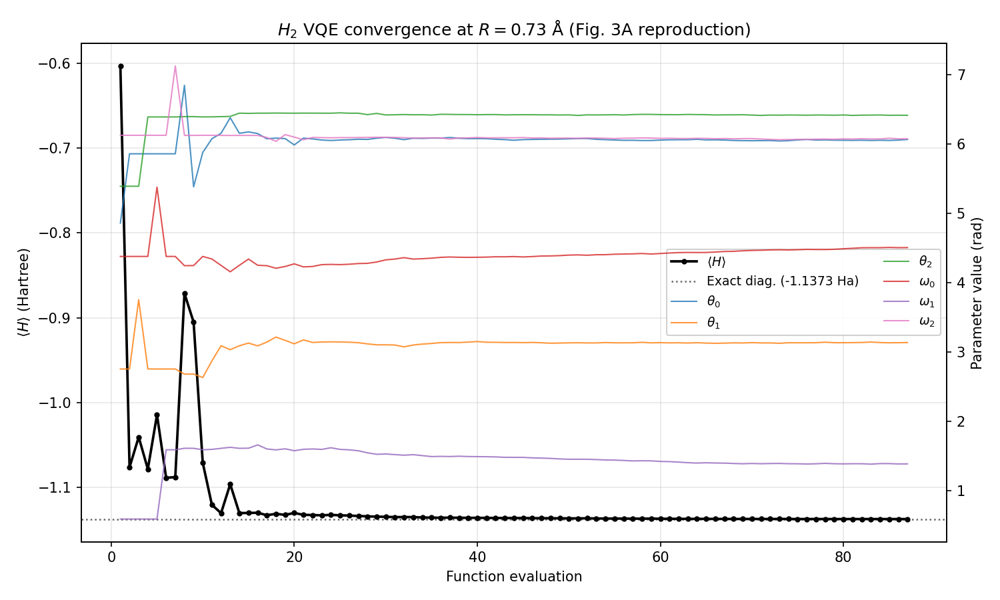
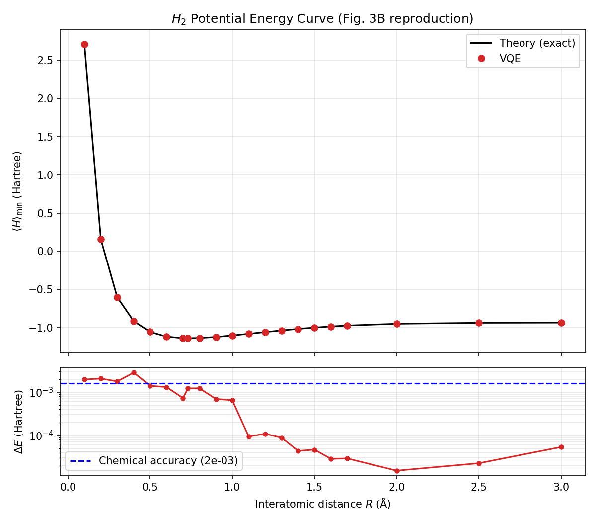
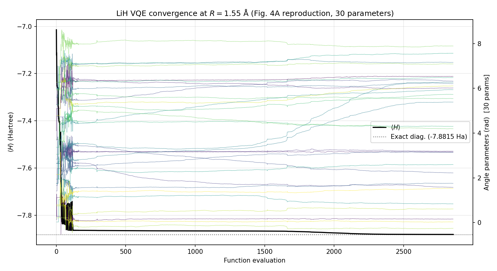
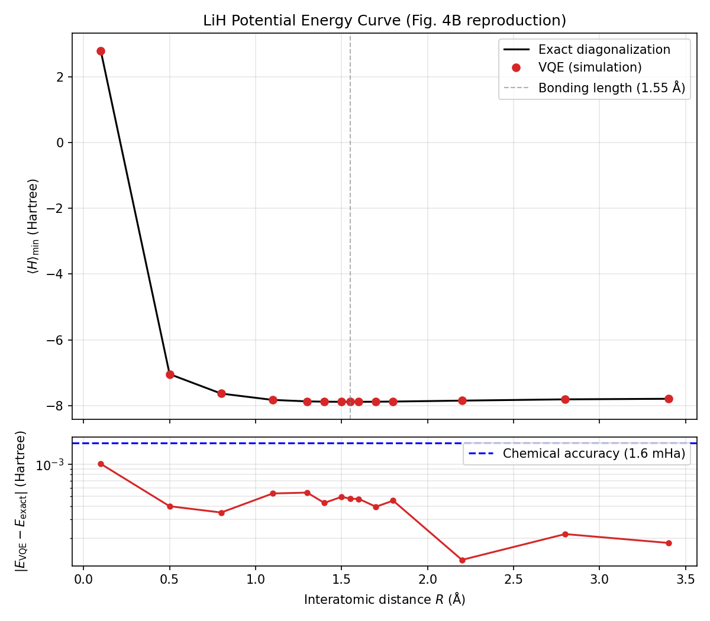

# sqd-vqe-reproduction

다음 논문의 VQE 알고리즘 부분을 Python으로 재현한 레포입니다.

> Kim et al., "Qudit-based variational quantum eigensolver using photonic
> orbital angular momentum states", *Sci. Adv.* **10**, eado3472 (2024).

논문은 궤도각운동량(OAM) 상태로 인코딩한 단일 광자 qudit 위에서 VQE를
수행합니다. 이 레포는 그중 고전 알고리즘 쪽 — Hamiltonian 구성, 각도
파라미터화 ansatz, COBYLA 최적화 — 을 시뮬레이션으로 재현합니다.

짝 레포: [`qudit-simulator-cpp`](../qudit-simulator-cpp) — 범용 C++ qudit
시뮬레이터. 에너지 평가 커널을 제공하며, 이 레포와 교차 검증되어 있습니다.

## 결과

### H2 — 4차원 qudit (2 qubit), 각도 파라미터 6개




Hamiltonian은 검증한 모든 원자간 거리에서 논문 Table S1과 소수 6자리까지
일치합니다. VQE는 21개 거리 중 19곳에서 chemical accuracy에 도달했고 평균
오차는 3.8e-4 Ha입니다.

실패한 두 지점은 R ≤ 0.2 Å입니다. 이 영역에서는 Hamiltonian 계수가 결합
길이 대비 한 자릿수 이상 큽니다 (Table S1 기준 R=0.1에서 II = 4.76, R=0.73에서
−0.33). COBYLA의 종료 기준 |α_{n+1} − α_n| < 0.01 — 논문이 명시한 값 — 은
파라미터 공간에서의 거리를 재므로, 계수가 크면 같은 파라미터 오차가 더 큰
에너지 오차로 번역됩니다. tolerance를 조이면 해결되지만 논문 설정에서
벗어나므로 그대로 두었습니다.

### LiH — 16차원 qudit (4 qubit), 각도 파라미터 30개




Hamiltonian은 Table S2(100개 Pauli string)와 소수 6자리까지 일치합니다.
VQE는 14개 거리 전부에서 chemical accuracy에 도달했고, 평균 오차는
4.3e-4 Ha입니다. 지점마다 무작위 초기값으로 5회 재시작합니다.

30차원 비볼록 지형에서 단일 실행의 성공률은 약 50%입니다. 실패는 −7.8632 Ha
부근에 몰리는데, 참값 −7.8815 Ha보다 뚜렷이 높은 별개의 local minimum입니다.
논문도 각 거리에서 여러 번 실험하고 최선의 결과를 보고했습니다 (Fig. 4B 캡션).

참고로 논문의 LiH 실험은 평균 오차 0.036 Ha로 chemical accuracy에 도달하지
못했습니다. OAM 상태의 purity와 fidelity가 한계였습니다 (Figs. S2, S3).
이 레포는 노이즈 없는 시뮬레이션이므로 더 정확한 것이 당연합니다. 재현
대상은 알고리즘의 거동이지 실험 오차가 아닙니다.

### 그림의 "Exact diagonalization"이 뜻하는 것

검은 곡선은 **VQE가 최적화하는 바로 그 축소 Hamiltonian**의 최소
고윳값입니다. full CI 결과도, 실험 참값도 아닙니다. 이 값이 재는 것은
COBYLA가 ansatz 공간에서 최소점을 얼마나 잘 찾았는가 하나뿐입니다.
Hamiltonian 자체의 정확성은 Table S1/S2 비교 테스트가 따로 담당합니다.

## 방법

| | H2 | LiH |
|---|---|---|
| 기저 | STO-3G | STO-3G |
| Spin orbital | 4 | 12 → 6 (active space) |
| Active space | 전체 | 2 전자, 3 orbital |
| 매핑 | Parity + 2-qubit reduction | Parity + 2-qubit reduction |
| Qubit (차원) | 2 (4D) | 4 (16D) |
| Pauli string | 5 | 100 |
| Ansatz 파라미터 | 6 | 30 |
| 결합 길이 | 0.73 Å | 1.55 Å |
| 지점당 재시작 | 3회 | 5회 |

LiH의 active space는 표준적인 축소를 따릅니다. Li 1s core를 동결하고,
z축 결합에 기여하지 않는 2p_x, 2p_y orbital을 제거합니다.

한 가지 함정이 있습니다. active space를 쓰면 상수항이 둘로 나뉩니다 —
nuclear repulsion (+1.02 Ha)과 frozen-core energy (−7.82 Ha). 둘 다 identity
계수에 합산해야 Table S2와 일치합니다. H2는 상수가 하나뿐이라 드러나지 않던
문제입니다.

두 ansatz — 논문 식 (5)의 4D와 식 (9)의 16D — 는 같은 이진 트리 구조입니다.
각 내부 노드에서 θ의 cos/sin으로 진폭이 갈리고, 그 노드의 ω는 **sin 쪽으로
갈 때만** 위상에 더해집니다. 일반화 함수 하나가 둘을 모두 처리하며, 기존
H2 테스트가 그 일반화의 검증 장치 역할을 합니다.

## C++ 커널 (선택)

`sqd_vqe.vqe`는 에너지 평가 경로를 둘 제공합니다.

| 함수 | 평가 경로 |
|---|---|
| `run_vqe`, `run_vqe_multistart` | NumPy. `state.conj() @ M @ state` |
| `run_vqe_cpp`, `run_vqe_multistart_cpp` | C++ 커널의 `expectation_dense` |

최적화 루프는 `_run_vqe_with_evaluator` 하나를 공유합니다. 평가 함수만
주입받으므로, 두 경로를 비교할 때 루프 차이를 의심할 필요가 없습니다.

C++ 모듈은 **선택적 의존성**입니다. `qudit_simulator`가 없어도 이 레포는
그대로 동작하고 테스트도 전부 통과합니다. `import`를 함수 안에서 하는 이유가
그것입니다.

두 커널이 서로 비트 단위로 일치하리라 기대하면 안 됩니다. 목적 함수가
1~4 ULP 다르고 COBYLA는 값을 비교해 움직이므로, 두 후보의 차이가 그 폭
안으로 좁혀지는 지점에서 비교가 뒤집히면 궤적이 갈립니다. 각 커널을 서로가
아니라 exact 값과 비교하는 것이 맞습니다.

## 환경 구성

```bash
uv sync
uv pip install -e .
uv run pytest tests/ -v    # 92개 테스트
```

Python 3.11과 `uv`가 필요합니다. WSL2 Ubuntu 24.04에서 개발했습니다.

C++ 커널까지 쓰려면 `qudit-simulator-cpp`를 `-DQUDIT_BUILD_PYTHON=ON`으로
빌드하고 `build/python`을 `PYTHONPATH`에 넣습니다.

## 그림 재현

```bash
uv run python examples/figures/h2_convergence_curve.py    # Fig. 3A
uv run python examples/figures/h2_potential_curve.py      # Fig. 3B
uv run python examples/figures/lih_convergence_curve.py   # Fig. 4A
uv run python examples/figures/lih_potential_curve.py     # Fig. 4B
```

LiH 스윕은 5분 정도 걸리고 나머지는 더 빠릅니다.

## 디렉토리 구조

```
sqd_vqe/
  hamiltonian.py   H2, LiH Hamiltonian 생성 + JSON 캐시
  ansatz.py        일반화된 d차원 ansatz. 식 (5), (9)
  expectation.py   Pauli 기대값 (reference 구현)
  vqe.py           COBYLA 루프. 단일 실행, multi-start, C++ 경로
  sweep.py         원자간 거리 스윕
  data/            고정된 Hamiltonian (아래 주의 참고)
tests/             92개 테스트
tools/
  dump_pauli.py              Qiskit Pauli 행렬 덤프 (endian 기준 데이터)
  dump_crossval_states.py    교차 검증용 state + Hamiltonian 텍스트 생성
  crossval_pybind.py         C++ 모듈을 Python 두 경로와 대조
  compare_sweep.py           두 커널로 스윕 전체 실행 후 비교
  benchmark_kernels.py       커널 마이크로 벤치마크
examples/
  figures/         논문 그림 4개
  exploration/     3주차 학습 스크립트
  diagnostics/     특정 문제를 추적하려고 쓴 도구들
results/           생성된 그림, 데이터, 교차 검증 입력
```

## 재현성에 관한 주의

Qiskit의 fermion → Pauli 변환은 같은 Pauli string끼리 계수를 합산할 때
내부 순회 순서가 프로세스마다 달라집니다. LiH의 100개 계수 중 16개가 실행
때마다 최대 152 ULP(상대오차 2e-14) 다르게 나옵니다. 전부 두 큐비트에만
작용하는 항인데, 이런 항이 가장 많은 fermionic 항으로부터 기여를 받아 재배열
효과가 가장 많이 쌓이기 때문입니다.

물리적으로는 무의미하고 Table S2와의 일치에도 영향이 없습니다. 하지만
30차원 COBYLA 최적화가 수천 번의 평가에 걸쳐 이를 증폭시켜 전혀 다른 local
minimum으로 수렴하게 만듭니다. 그래서 Hamiltonian은 한 번만 생성해
`sqd_vqe/data/`에 JSON으로 고정합니다. C++ 교차 검증도 같은 파일을 읽습니다.

`examples/diagnostics/`의 스크립트들이 이 문제를 추적한 과정을 담고 있습니다.
PySCF는 비트 단위로 결정적이라는 것이 확인되었으므로, 원인은 그 아래 단계에
있을 수밖에 없었습니다.